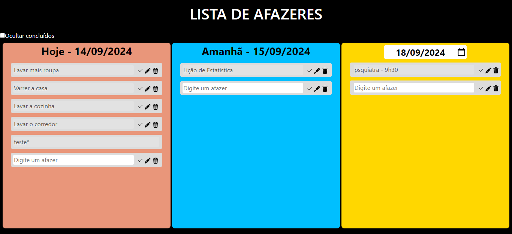

# Lista de Afazeres
Projeto simples para gerenciamento de afazeres diários, desenvolvido em .NET com um front-end em HTML, CSS e JavaScript. O objetivo do projeto é praticar o desenvolvimento de APIs com C#.

# Resumo
O sistema tem uma única tela, onde é exibido três retângulos com as tarefas do dia atual, do dia seguinte e no terceiro retangulo é possível escolher a data. Inicialmente é exibido dois dias após o dia atual.
Os afazeres são digitados no campo em branco, sendo salvos com a tecla enter ou retirando o cursor do campo.

# Funcionalidades
- Cadastrar tarefas em listas divididas por data (não é possível cadastrar tarefas com descrição em branco)
- Editar a descrição das tarefas
- Excluir tarefas
- Concluir tarefas
- Após conclusão, não é possível excluir ou editar a tarefa
- Ocultar tarefas concluídas
- As atividades não realizadas no dia, são automaticamente replicadas para o próximo com um asterisco (*)
